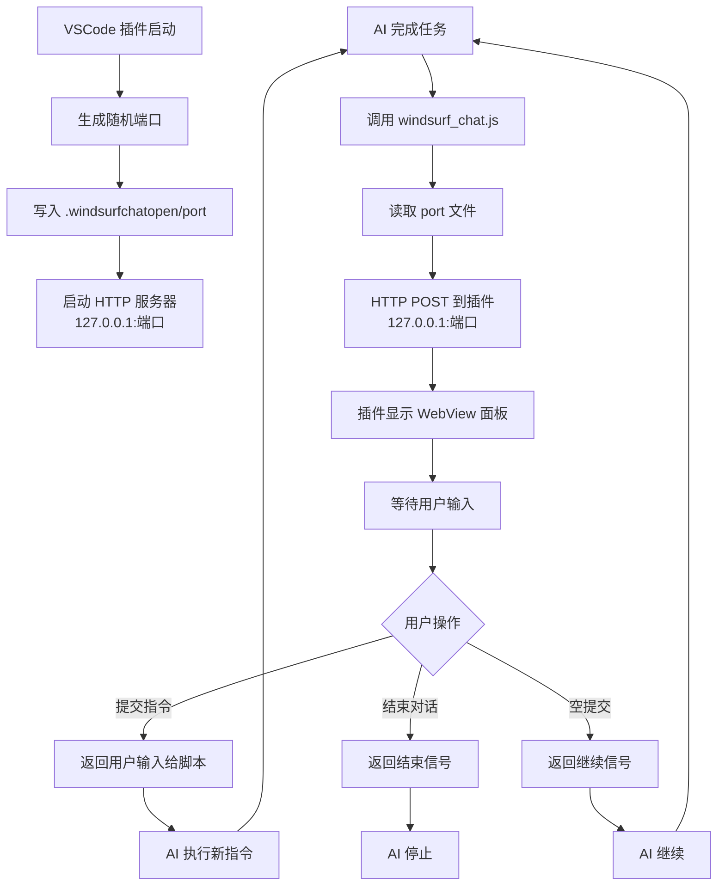

# WindsurfChat Open - 架构流程

## 核心调用流程



## 端口隔离机制

```
工作区 A
├── .windsurfchatopen/
│   ├── port (35386)
│   └── windsurf_chat.js
└── HTTP 服务器: 127.0.0.1:35386

工作区 B
├── .windsurfchatopen/
│   ├── port (41203)
│   └── windsurf_chat.js
└── HTTP 服务器: 127.0.0.1:41203
```

**关键点**：
- 每个工作区独立端口，互不干扰
- 脚本通过 `__dirname` 定位 `port` 文件
- 端口范围：30000-60000 随机生成
- 脚本默认端口：34500（port 文件不存在时）

## 数据流

```
AI → windsurf_chat.js → 读取 port → HTTP POST → 插件 → WebView
                                                        ↓
AI ← 脚本输出 ← HTTP 响应 ← 插件 ← 用户输入 ← WebView
```
