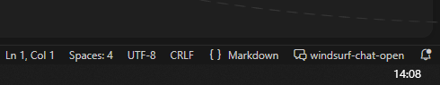

# WindsurfChat Open

让 AI 停下来听你说话 - 随时介入对话，精准反馈指令

## 核心特性

- **项目级隔离** - 多 IDE / 多项目互不干扰
- **等待指示器** - 闪烁提示，状态一目了然
- **支持图片反馈** - 粘贴/拖拽图片到文本框
- **浅色/深色主题自适应**

## 快速开始

### 1. 安装插件

从 [Releases](https://github.com/nicepkg/windsurf-chat-open/releases) 下载 `.vsix` 文件，然后：

```
Ctrl+Shift+P → Extensions: Install from VSIX...
```

### 2. 配置全局提示词

在 Windsurf **全局提示词** 中添加：

```
遵循工作区规则，每次回复结束前调用脚本
```

### 3. 打开面板
点击右下角 `windsurf-chat-open`打开面板


### 4. 开始使用

## 说明

**文件创建**：插件会在项目根目录自动创建：
- `.windsurfchatopen/` 文件夹 - 存储核心脚本和会话数据
- `.windsurfrules` 文件 - 工作区规则文件，AI 会自动读取并遵循其中的规则

如果是 git 项目，上述文件会自动添加到 `.gitignore`，不会影响版本控制。

**超时保护**：AI 等待超过 30 分钟会自动超时，避免长时间占用。

## 开源协议

MIT License
